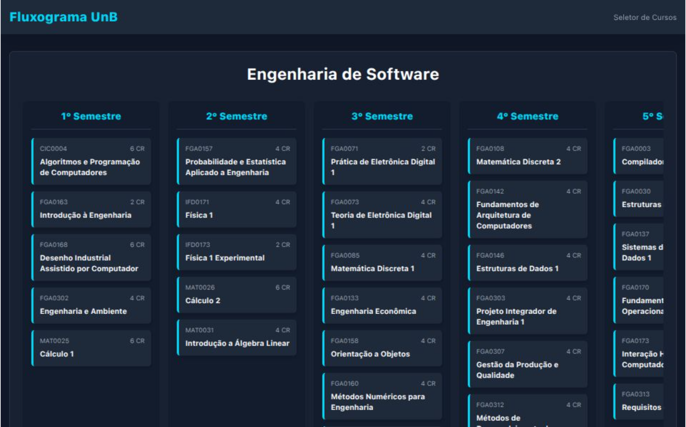

# Fluxograma Interativo de Cursos - UnB (Versão React)

<div align="center">
  
  
</div>

<br>



Este repositório contém a nova versão do projeto **Fluxograma Interativo de Cursos**, agora a ser refatorado com **React** e **TypeScript** para criar uma plataforma mais robusta, escalável e moderna.

O objetivo é transformar a ferramenta inicial numa aplicação completa que sirva não apenas aos estudantes de Engenharia de Software, mas a todos os cursos da Universidade de Brasília (UnB).

> **Atenção:** Este projeto está em fase de desenvolvimento ativo. A versão estável anterior (em JavaScript puro) pode ser encontrada [neste link](https://afrontoso.github.io/FluxogramaCurso/).

---

## 🚀 Visão do Projeto

A meta é criar um "Planejador de Graduação" completo, onde os estudantes da UnB possam:

-   Visualizar a grade curricular completa do seu curso de forma interativa.
-   Entender as dependências entre as matérias através de um sistema visual de pré-requisitos.
-   Marcar matérias como concluídas e acompanhar o seu progresso em tempo real.
-   Adicionar matérias optativas e de extensão para personalizar o seu percurso académico.
-   Salvar todo o seu progresso de forma segura na nuvem, associado à sua conta.

## ✨ Funcionalidades Planeadas (Roadmap)

-   [x] Estrutura base do projeto com Vite, React e TypeScript.
-   [x] Configuração do Tailwind CSS para estilização.
-   [ ] Componentização da interface (Header, Flowchart, SubjectCard).
-   [ ] Carregamento dinâmico dos dados do curso a partir de ficheiros JSON/TS.
-   [ ] Implementação da lógica de pré-requisitos com a biblioteca `Leader-Line`.
-   [ ] Integração com Firebase Authentication para login com Google.
-   [ ] Integração com Firebase Firestore para persistência de dados do utilizador.
-   [ ] Implementação do painel de progresso (créditos/horas).
-   [ ] Sistema de seleção para múltiplos cursos.
-   [ ] Hospedagem na Vercel com integração contínua.

---

## 🛠️ Tecnologias Utilizadas

-   **Framework:** [React](https://react.dev/)
-   **Linguagem:** [TypeScript](https://www.typescriptlang.org/)
-   **Ferramenta de Build:** [Vite](https://vitejs.dev/)
-   **Estilização:** [Tailwind CSS](https://tailwindcss.com/)
-   **Backend & Base de Dados:** [Google Firebase](https://firebase.google.com/) (Authentication & Firestore)
-   **Hospedagem:** [Vercel](https://vercel.com/)

---

## ⚙️ Como Executar o Projeto Localmente

Para contribuir ou simplesmente testar o projeto na sua máquina, siga estes passos:

1.  **Clone o repositório:**
    ```bash
    git clone [https://github.com/Afrontoso/fluxograma-react.git](https://github.com/Afrontoso/fluxograma-react.git)
    ```

2.  **Navegue para a pasta do projeto:**
    ```bash
    cd fluxograma-react
    ```

3.  **Instale as dependências:**
    ```bash
    npm install
    ```

4.  **Inicie o servidor de desenvolvimento:**
    ```bash
    npm run dev
    ```

5.  Abra [http://localhost:5173](http://localhost:5173) (ou o endereço indicado no seu terminal) para ver a aplicação.

---

## Licença

Este projeto está sob a licença MIT. Veja o ficheiro `LICENSE` para mais detalhes.